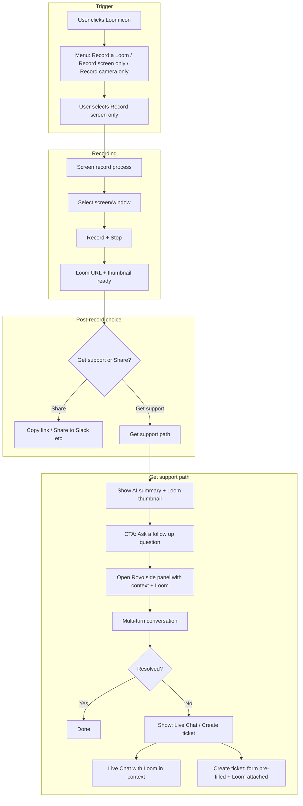

# PRD: Loom Record → Get Support Flow

**Product:** Support Insights 360 – Rovo Unified Help  
**Document:** Product Requirements Document  
**Flow:** Loom “Record screen only” → Post-recording choice → Get support (AI first, escalate to Live Chat / Ticket with Loom attached)  
**Status:** Draft  
**Last updated:** 2026

---

## Executive summary

When users record their screen with Loom to show an issue, they should have one clear path to get help: **Get support** or **Share**. Choosing **Get support** leads them through an **AI-first** path: see a relevant summary, ask follow-up questions in the Rovo side panel, and only if that doesn’t resolve the issue, escalate to **Live Chat** or **Create a support ticket**—with the Loom video and page context **automatically attached** so agents can review the recording without back-and-forth.

This PRD defines that flow end-to-end: triggers, screens, copy, escalation rules, and how Loom + context are passed into chat and ticket creation.

---

## 1. Problem & opportunity

### 1.1 Problem

- Users who record their screen to document a bug or question often don’t know the next step: paste the link in a ticket? Start a chat? Re-explain everything?
- Support agents frequently have to ask for a recording or context, then wait for the user to paste a Loom link and repeat the issue.
- Help flows are disconnected: recording happens in one place, support in another, and context (page, insight, description) is lost.

### 1.2 Opportunity

- **One path:** From “I just recorded my screen” to “I got support” with minimal decisions.
- **AI first:** Use Rovo to summarize, suggest articles, and answer follow-ups before involving a human.
- **Context by default:** Attach Loom + page + conversation summary to every escalation so agents can resolve faster.

### 1.3 Goals

| Goal | How we measure it |
|------|-------------------|
| Reduce friction | Fewer steps from “recording done” to “support requested”; single primary CTA at each step. |
| Increase deflection | % of Get-support users who resolve in Rovo (no Live Chat / Ticket). |
| Preserve context | 100% of escalated tickets/chats from this flow include Loom link + page/description. |
| Agent efficiency | Shorter handle time and fewer “please send a recording” replies when Loom is attached. |

---

## 2. User stories (jobs to be done)

**Persona:** Support lead or agent using Support Insights 360 who hits an issue (e.g. SLA breach risk, billing surge), records their screen to show it, and wants help.

| # | Job to be done | User story |
|---|----------------|------------|
| 1 | Record only what’s needed | As a user, I can choose “Record screen only” so I don’t have to show my face when documenting a technical issue. |
| 2 | Decide next step quickly | As a user, after I finish recording, I’m asked “Get support or Share?” so I can choose without hunting for buttons. |
| 3 | Try self-service first | As a user, when I choose Get support, I see a short AI summary and can “Ask a follow up question” so I can try to fix it myself before talking to an agent. |
| 4 | Escalate when stuck | As a user, when the conversation isn’t helping, I can choose Live Chat or Create a ticket so I can reach a human without starting over. |
| 5 | Never re-attach the video | As a user, when I create a ticket or start chat from this flow, my Loom is already attached so I don’t have to paste the link or repeat myself. |

---

## 3. User flow (detailed)

### 3.1 Flow diagram

### 3.2 Step-by-step (Get support path)

1. **Loom icon → Record screen only**  
   User clicks Loom (header or omnibox), menu shows three options; user selects “Record screen only.”

2. **Screen record process**  
   App shows recording UI (e.g. Loom SDK or browser `getDisplayMedia`). User selects screen/window, records, stops. App receives Loom `sharedUrl`, `embedUrl`, `thumbnailUrl`, duration.

3. **Post-recording: Get support or Share**  
   Single screen with two clear actions:
   - **Get support** – continues to step 4.
   - **Share recording** – copy link or share (e.g. Slack); flow can end or return to app.

4. **Get support: AI summary + CTA**  
   - Show a **relevant AI summary** (from current page/insight, optional short user description, and “Screen recording from [page]”).
   - Show **Loom thumbnail** (and optional “Watch” link) so user sees the recording is in context.
   - Primary CTA: **“Ask a follow up question”**.

5. **Ask a follow up question → Rovo side panel**  
   Same behaviour as “type in prompt then click Live Chat” in Support AI Agent: set issue context (including “Screen recording attached” + summary), open Rovo panel in live-chat mode with “Your issue” pre-filled and “Connect with a live agent” available. Panel shows Loom is attached (thumbnail + link).

6. **Multi-turn in Rovo**  
   User asks follow-ups; Rovo answers, suggests articles, etc. Standard Rovo behaviour.

7. **Escalation only when “conversation doesn’t resolve”**  
   When the escalation condition is met (see §5), show:
   - **Live Chat** – open chat with same context + Loom link for the agent.
   - **Create a support ticket** – open form with subject/description pre-filled and Loom attached; user can edit and submit.

8. **Ticket / Chat with Loom**  
   - Ticket: subject, description, and Loom URL (and thumbnail) saved; agent sees “Screen recording attached” and can open Loom.
   - Chat: agent sees issue text and Loom link (and optionally inline embed) so they can watch without asking.

---

## 4. Suggested UI copy & microcopy

Use as a starting point; adjust for tone and product naming.

| Location | Copy |
|----------|------|
| Post-recording title | “Recording ready” or “What would you like to do?” |
| Get support button | “Get support” |
| Share button | “Share recording” (sub: “Copy link or share to Slack”) |
| Get-support screen title | “We’ve got context from your recording” or “Here’s what we see” |
| AI summary label | “Summary” or “Relevant to your recording” |
| Primary CTA | “Ask a follow up question” |
| Rovo panel when Loom attached | “Your issue” + short summary; below: “Screen recording attached” + thumbnail + “Watch” link |
| When escalation is shown | “Still need help?” or “Talk to an agent” |
| Live Chat option | “Live Chat” (sub: “Connect with an agent now”) |
| Create ticket option | “Create a support ticket” (sub: “We’ll follow up via email; your recording is attached”) |
| Ticket form when Loom pre-filled | “Screen recording attached for review” (with thumbnail); subject/description pre-filled, editable. |

---

## 5. When to show Live Chat & Create ticket (“conversation failed”)

**Proposed rule (implement and tune as needed):**

- **Explicit:** User taps “I still need help,” “Talk to an agent,” or “Create a ticket” in the Rovo panel (e.g. in the Support AI Agent dropdown or a persistent footer in the panel when coming from this flow).
- **Implicit (optional):** After N turns (e.g. 3–5) without a “resolved” signal (e.g. user clicking “That fixed it” or closing the panel), show a one-time prompt: “Still need help? You can start a live chat or create a ticket—your recording will be attached.”

Do **not** show Live Chat / Create ticket as the primary path before the user has had a chance to use “Ask a follow up question” and at least one or two exchanges.

*Document the final rule (explicit only vs explicit + implicit) in an eng/design spec.*

---

## 6. Detailed requirements

### 6.1 Loom icon & “Record screen only”

| ID | Requirement | Acceptance criteria |
|----|-------------|---------------------|
| L1 | Loom icon opens a menu with recording options. | Options include: “Record a Loom” (screen & camera), “Record screen only,” “Record camera only.” |
| L2 | “Record screen only” starts a screen-only flow. | No camera stream; only display/window capture. |
| L3 | Same Loom integration (SDK / getDisplayMedia) used; screen-only is a parameter. | Recording completes with `sharedUrl`, `embedUrl`, `thumbnailUrl`, duration. |

### 6.2 Screen record process

| ID | Requirement | Acceptance criteria |
|----|-------------|---------------------|
| S1 | After “Record screen only,” a clear recording experience is shown. | User can select screen/window, see recording state, and stop. |
| S2 | On completion, Loom metadata is available to the app. | `sharedUrl`, `embedUrl`, `thumbnailUrl`, duration stored (e.g. in state or context). |
| S3 | If user cancels or recording fails, they can retry or exit. | No broken state; no forced Get support / Share. |
| S4 | Optional: short “What’s this about?” free text before or after recording. | If implemented, this is included in the AI summary and issue context. |

### 6.3 Post-recording: Get support vs Share

| ID | Requirement | Acceptance criteria |
|----|-------------|---------------------|
| P1 | After a successful recording, user sees a single choice: Get support or Share. | Two primary actions; no extra steps to reach either. |
| P2 | Share: copy Loom link and/or share to configured channels (e.g. Slack). | Link is copyable; share targets per product config. |
| P3 | Get support: continues to AI summary and “Ask a follow up question” with Loom and page context preserved. | No loss of Loom URL, thumbnail, or page/insight context. |

### 6.4 Get support: AI summary & Ask a follow up question

| ID | Requirement | Acceptance criteria |
|----|-------------|---------------------|
| G1 | Show a relevant AI summary when user selects Get support. | Summary uses: current page/insight, optional user description, and “Screen recording from [page].” |
| G2 | Show Loom thumbnail (and optional “Watch” link). | User sees the recording is part of the context. |
| G3 | Primary CTA: “Ask a follow up question.” | One clear button/link. |
| G4 | Clicking it opens Rovo side panel with support context. | Same behaviour as “type query + Live Chat” from Support AI Agent: `setQuery(context)`, `openChatPanel('__live_chat__')`. Issue text includes recording + summary. |
| G5 | Rovo panel indicates a Loom is attached. | Thumbnail + link (and optional “Watch”) visible to user (and later to agent in chat/ticket). |

### 6.5 Multi-turn & escalation

| ID | Requirement | Acceptance criteria |
|----|-------------|---------------------|
| M1 | User can have a multi-turn conversation in Rovo. | Standard Rovo behaviour: send messages, get answers and/or links. |
| M2 | Live Chat and Create ticket are shown only when “conversation failed” (per §5). | Not shown as primary path before user has tried follow-up; explicit (and optionally implicit) rule implemented. |
| M3 | When shown, both options are available: Live Chat and Create a support ticket. | User can choose either; Loom + context apply to both. |

### 6.6 Live Chat with Loom context

| ID | Requirement | Acceptance criteria |
|----|-------------|---------------------|
| C1 | Live Chat opens with issue and Loom in context. | Same as current Live Chat from Support AI Agent; Loom link (and thumbnail) included. |
| C2 | Agent sees that a Loom is attached and can open it. | Agent UI shows link and/or embed so they can watch without asking the user. |

### 6.7 Create a support ticket with Loom attached

| ID | Requirement | Acceptance criteria |
|----|-------------|---------------------|
| T1 | Ticket form opens with subject and description pre-filled. | Uses page/insight context and AI summary or user’s last message. |
| T2 | Loom is pre-attached (no re-recording). | Form shows “Screen recording attached” and thumbnail; `loomUrl` (and optional `loomThumb`) set from this flow. |
| T3 | User can edit subject and description before submit. | Pre-fill does not overwrite subsequent edits. |
| T4 | On submit, ticket is created with Loom URL and context. | Backend receives Loom link; agents can open it from the ticket. |

---

## 7. Edge cases & error handling

| Scenario | Desired behaviour |
|----------|-------------------|
| User closes Rovo panel after “Ask a follow up question” | Loom + context remain in OmniBox/session so if they reopen or go to Live Chat / Ticket later, context is still available (within session). |
| User selects Get support but never clicks “Ask a follow up question” | After a short delay or on panel open, we can show a nudge: “Ask a follow up question to get started,” or leave as-is. |
| Recording fails (permission denied, tab closed) | Show clear error + retry; do not show Get support / Share until a recording exists. |
| User has no description / page context (e.g. started from home) | AI summary can be minimal: “Screen recording attached; describe your issue in a follow-up.” |
| Ticket form opened from elsewhere (not from this flow) | No pre-filled Loom; existing behaviour (manual paste or record) unchanged. |

---

## 8. Out of scope (this PRD)

- Full design of **Share** (Slack deep links, email templates, etc.) beyond “copy link / share.”
- Loom SDK or browser capture changes beyond supporting “screen only.”
- Backend ticket API or agent workspace UI; PRD assumes form submits with Loom + context.
- “Record a Loom” and “Record camera only” flows (can reuse Get support / Share pattern in a later PRD).
- Formal definition of “resolved” (e.g. sentiment, button); escalation rule is in §5.

---

## 9. Dependencies & technical notes

- **Loom:** `useLoom` (or Loom SDK) must support screen-only and expose `sharedUrl`, `embedUrl`, `thumbnailUrl` after recording.
- **OmniBox / Rovo:** `omniBox.setQuery`, `omniBox.openChatPanel('__live_chat__')`, `omniBox.openTicketForm()`; need a way to pass Loom URL/thumbnail into the ticket form (e.g. extended context or dedicated state when opening from this flow).
- **Ticket form:** Already supports Loom (`LoomRecorder`, `loomUrl`, `loomThumb`); must accept **pre-filled** Loom when opened from “Create a support ticket” after this flow so the form shows “attached” without re-recording.

---

## 10. Success metrics

| Metric | Target (example) |
|--------|-------------------|
| % Get-support users who resolve in Rovo (no escalation) | Increase vs baseline (e.g. 30%+ deflection). |
| % who escalate to Live Chat vs Create Ticket | Track split; optimize copy/placement if skewed. |
| Time from “Record screen only” to ticket created or chat started | Reduce (e.g. &lt; 2 min when they do escalate). |
| Tickets/chats from this flow that include Loom | 100%. |
| Agent CSAT or “Loom helped” feedback on tickets with Loom | Optional survey or tag. |

---

## 11. Open questions & future work

- **Optional “What’s this about?”** before or after recording to improve AI summary.
- **Inline Loom embed** in Rovo panel or ticket form for “Watch” without leaving the page.
- **Reuse Get support / Share** for “Record a Loom” and “Record camera only” for consistency.
- **Analytics:** events at each step (Record started, Get support chosen, Ask follow-up clicked, Escalation to Chat/Ticket) for funnel and drop-off.

---

## 12. Document history

| Version | Date | Author | Changes |
|---------|------|--------|---------|
| 0.1 | — | — | Initial PRD. |
| 0.2 | — | — | Improvised: executive summary, user stories, UI copy, escalation rule, edge cases, metrics, open questions. |
